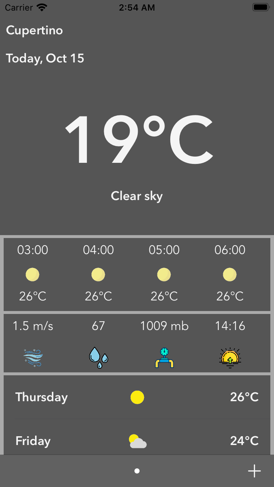
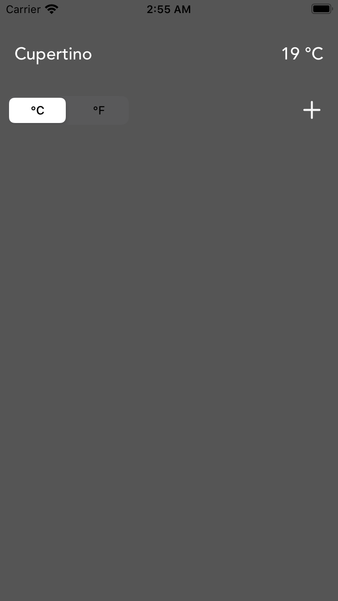
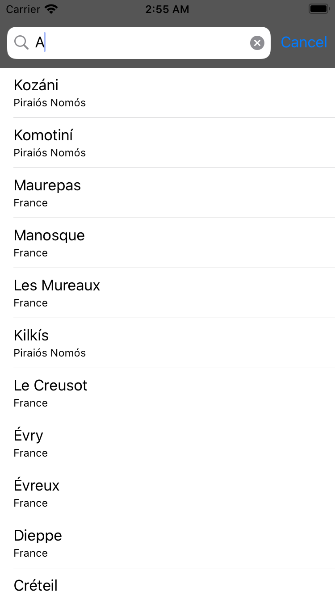
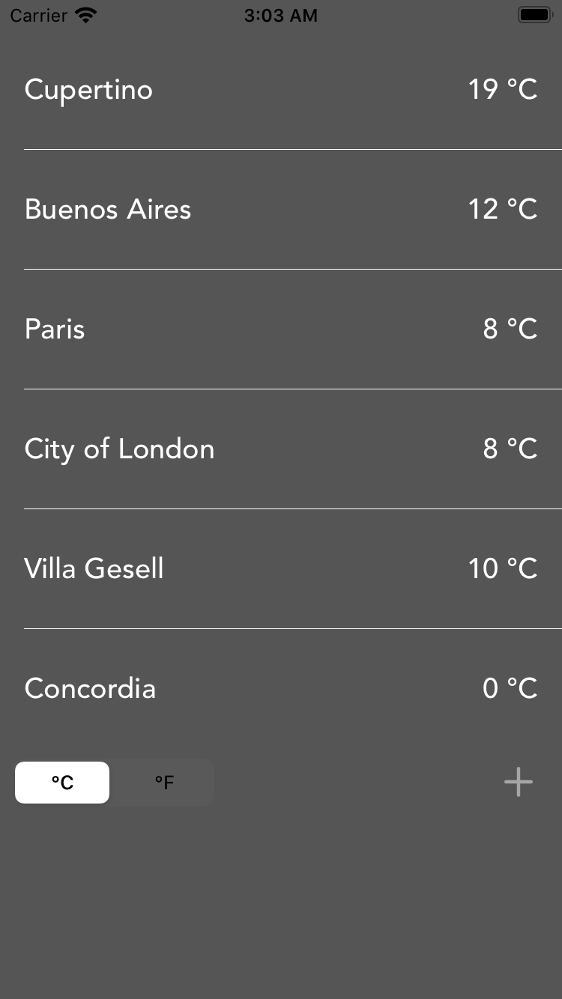
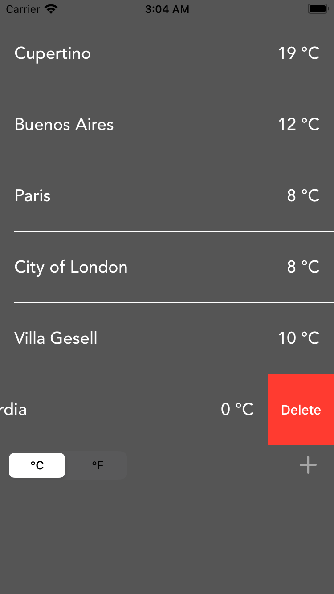
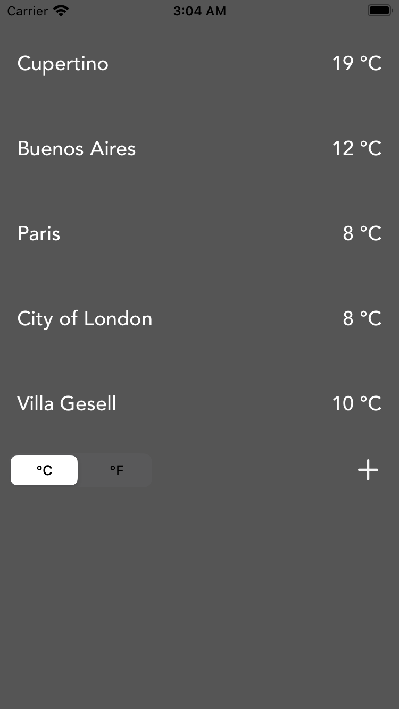
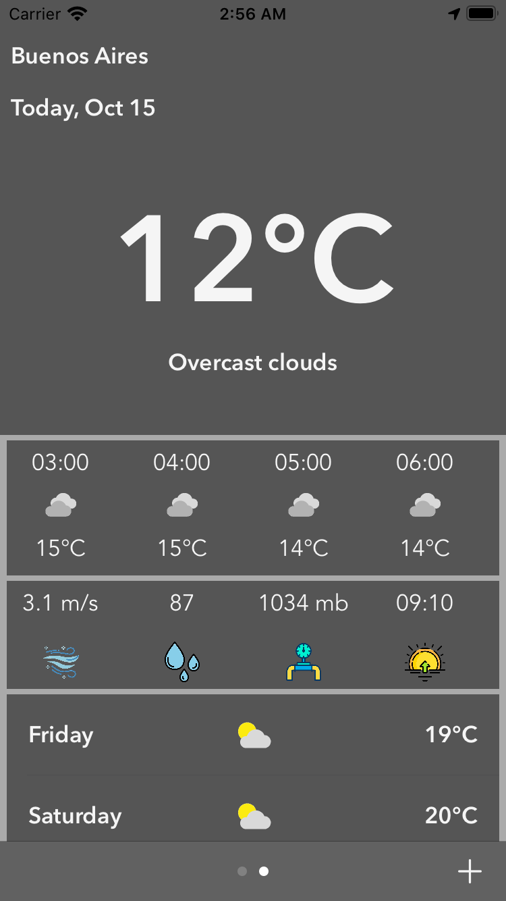
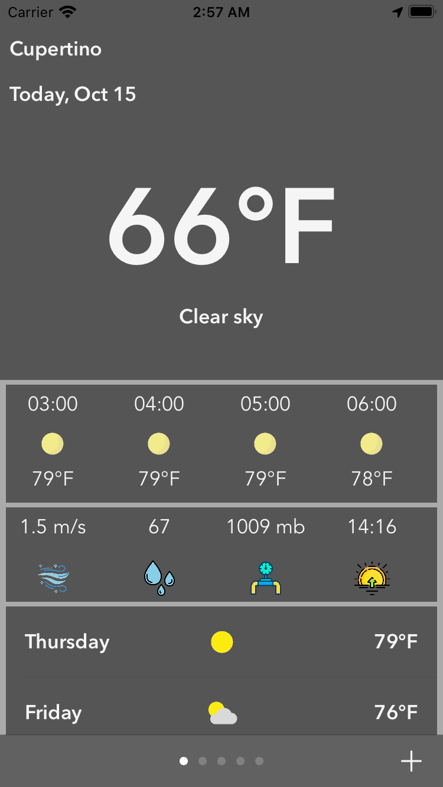

# ClimaApp

A swift project to create a weather application in Swift 5.

## Features
- CocoaPods
- SwiftyJson
- Alamofire
- Rest API (weatherbit.io)
- Parse CSV files
- Current weather for your current  location
- 24 hour Weather forecast for your current location
- Weekly (7 days) weather forecast for your current location
- Current weather for Any City of your choice (max 5)
- Custom views using storyboard and XIB files

## Screenshots

***************

***************

***************

***************

***************

***************

***************

***************

***************
